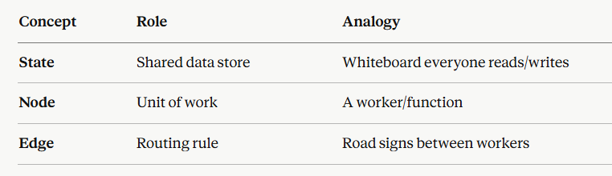

### 🔘**Core Idea of LangGraph**
```
LangGraph: Nodes, Edges, and State.

LangGraph is a framework for building stateful, multi-agent LLM applications as graphs. Let me break down the three core primitives in depth.
```

```
LangGraph models agents as a Graph.
A graph contains:
    🔹Nodes → actions
    🔹Edges → transitions
    🔹State → shared memory
```
--------------------------------------------------------------------------------------------------------------------------

### **🧠 State**
```
State is the shared memory of your graph — a data structure that every node can read from and write to. It flows through the entire graph and represents "what do we know so far."
```

***Defining State***
```python
from typing import TypedDict, Annotated
from langgraph.graph import StateGraph
import operator

class AgentState(TypedDict):
    messages: Annotated[list, operator.add]   # reducer: appends new messages
    current_step: str
    iterations: int
    final_answer: str | None
```

#### 🔶**Key Concepts**

*Reducers —*
```
When multiple nodes update the same key, a reducer function decides how to merge values:
```
```python
# Without reducer → last-write-wins (overwrites)
class State(TypedDict):
    name: str              # "Alice" → "Bob" → final = "Bob"

# With reducer → values are combined
class State(TypedDict):
    messages: Annotated[list, operator.add]   # [msg1] + [msg2] → [msg1, msg2]
    score: Annotated[int, lambda a, b: a + b] # 10 + 5 → 15
```
*Partial updates —*
```
Nodes return only the keys they want to change:
```
```py
def my_node(state: AgentState) -> dict:
    return {"current_step": "done"}   # only updates current_step, rest unchanged

```
----------------------------------------------------------------------------------------------------------------------------

### **📦 Nodes**
```
Nodes are the workers — Python functions (or runnables) that receive the current state, do some work, and return updates to the state.
```
*Basic Node —*
```python
from langchain_openai import ChatOpenAI

llm = ChatOpenAI(model="gpt-4o")

def call_llm(state: AgentState) -> dict:
    # Read from state
    messages = state["messages"]
    
    # Do work
    response = llm.invoke(messages)
    
    # Return state update
    return {"messages": [response]}

def validate_output(state: AgentState) -> dict:
    last_msg = state["messages"][-1].content
    is_valid = len(last_msg) > 10
    return {"final_answer": last_msg if is_valid else None}
```

*Adding Nodes to Graph —*
```python
builder = StateGraph(AgentState)

builder.add_node("llm_caller", call_llm)
builder.add_node("validator", validate_output)

```
#### 🔶**Node Types**
Type                Description
```
Function node       Plain Python def or async def
Runnable node       Any LangChain Runnable (chains, prompts, etc.)
Subgraph node       An entire compiled graph used as a single node
Tool node           ToolNode from LangGraph — auto-executes tool calls
```

*Addiing Tools —*
```python
from langgraph.prebuilt import ToolNode

tools = [search_tool, calculator_tool]
tool_node = ToolNode(tools)
builder.add_node("tools", tool_node)

```
-------------------------------------------------------------------------------------------------------------------

### **🔗 Edges**
```
Edges define control flow — which node runs next after the current one finishes.
```

#### 🔷**Types of Edges:**

⚪**1. Normal Edges — Always go A → B**
```py
builder.add_edge("llm_caller", "validator")   # always flows here
```

⚪**2. Entry & Finish Points**
```py
from langgraph.graph import START, END

builder.set_entry_point("llm_caller")         # where execution begins
builder.add_edge("validator", END)            # where execution ends

# Or using START/END constants:
builder.add_edge(START, "llm_caller")
```

⚪**3. Conditional Edges — Dynamic routing based on state**

This is LangGraph's most powerful feature — branching logic:

```py
def should_retry(state: AgentState) -> str:
    """Router function: returns the name of the next node."""
    if state["final_answer"] is None:
        return "retry"
    elif state["iterations"] > 5:
        return "give_up"
    else:
        return "done"

builder.add_conditional_edges(
    "validator",                          # from this node
    should_retry,                         # call this router
    {                                     # map return value → node name
        "retry":    "llm_caller",
        "give_up":  "fallback_node",
        "done":     END
    }
)
```

⚪**4. Parallel Fan-Out / Fan-In**

You can send to multiple nodes simultaneously:

```py
# Fan-out: validator → both nodes run in parallel
builder.add_edge("validator", "summarizer")
builder.add_edge("validator", "fact_checker")

# Fan-in: both must complete before final_node runs
builder.add_edge("summarizer", "final_node")
builder.add_edge("fact_checker", "final_node")
```

-----------------------------------------------------------------------------------------------------------------------

### 🔶**Putting It All Together — ReAct Agent Example**

```py

from typing import TypedDict, Annotated
from langgraph.graph import StateGraph, START, END
from langgraph.prebuilt import ToolNode
from langchain_core.messages import BaseMessage
import operator

# ── 1. State ──────────────────────────────────────────
class AgentState(TypedDict):
    messages: Annotated[list[BaseMessage], operator.add]

# ── 2. Nodes ──────────────────────────────────────────
tools = [search_tool, calculator_tool]
llm_with_tools = llm.bind_tools(tools)

def agent(state: AgentState) -> dict:
    response = llm_with_tools.invoke(state["messages"])
    return {"messages": [response]}

tool_node = ToolNode(tools) 

# ── 3. Router (used in conditional edge) ──────────────
def should_use_tools(state: AgentState) -> str:
    last = state["messages"][-1]
    if hasattr(last, "tool_calls") and last.tool_calls:
        return "tools"
    return "end"

# ── 4. Build Graph ────────────────────────────────────
builder = StateGraph(AgentState)

builder.add_node("agent", agent)
builder.add_node("tools", tool_node)

builder.add_edge(START, "agent")
builder.add_conditional_edges("agent", should_use_tools, {
    "tools": "tools",
    "end":   END
})
builder.add_edge("tools", "agent")   # loop back after tool use

graph = builder.compile()
```


🔷**WorkFlow:**
```
This creates the classic agent loop:
START → agent → [has tool calls?]
                    YES → tools → agent (loop)
                    NO  → END
```

### 🔶**Summary**

<p align="center">

</p>


⚪⚫⚪  Lets learn: [Conditional Edges](./03_Conditional_Edges.md)

<!-- 🔷🔶🔹🔸🔘🔴🟠🟡⚪⚫🟤🟣🔵🟢 -->