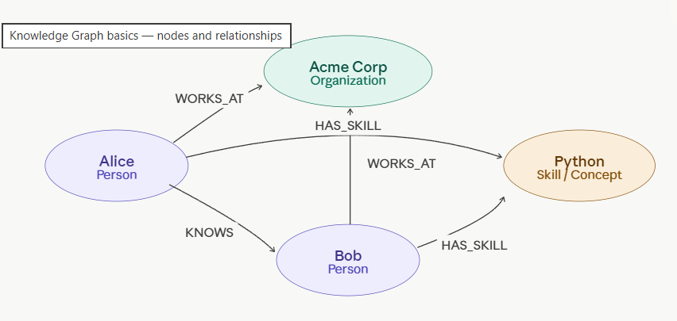

### 🔶🔷🔶**What is a Knowledge Graph?**
```
A knowledge graph is a way of representing information as a network of entities (nodes) and relationships (edges) between them. Instead of storing data in flat rows and columns, you model the world as connected facts.
```
*The three core primitives are:*
```
Node            — an entity (a person, place, concept, document)
Relationship    — a directed, labeled connection between two nodes
Property        — key-value data attached to a node or relationship
```
*Everything is stored as a triple:*
```
(Subject) -[Predicate]-> (Object)

e.g. (Alice) -[WORKS_AT]-> (Acme Corp).
```

<p align="center">

</p>


```
🔸Each node has a label (like Person or Organization) and each edge has a type (like WORKS_AT or HAS_SKILL). 
🔸Both can carry properties — Alice might have {name: "Alice", age: 32}, and a WORKS_AT edge might have {since: 2021}.
```
<!-- ⚪⚫⚪  Lets learn  : [07_Semantic_Memory](./07_Semantic_Memory.md) -->
<!-- 🔷🔶🔹🔸⭐🔘🔴🟠🟡⚪⚫🟤🟣🔵🟢 -->