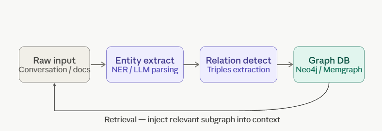

### 🔶**Graph Memory**
```
Graph memory is the use of a knowledge graph as the long-term memory layer for an AI system. 
Instead of cramming everything into a context window (which is flat, lossy, and temporary), you persist facts as structured nodes and edges that can be queried, updated, and reasoned over.
```

*The typical lifecycle looks like this:*
<p align="center">

</p>

*The core problem it solves:*
```
 A normal AI has no memory between conversations. Every time you start fresh, it knows nothing about you. Graph memory fixes this by storing facts outside the AI, in a database shaped like a network.
```
**What happens turn by turn:**
```
🔸You say something — "I live in Delhi, I work at Google"
🔸The system extracts facts from your words — it pulls out entities (Delhi, Google, You) and the relationships between them (LIVES_IN, WORKS_AT)
🔸Those facts get saved as nodes and edges in a graph database — permanently, not just in the chat window
🔸Next time you ask a question, the system queries the graph first — "what do I know about this user?" — and injects those facts into the AI's context before it 
```

*Why a graph and not a list?* 

```
Because facts connect to each other. If you know Priya works at Google, and you work at Google, the graph can answer "who are my colleagues?" by following edges — that's called a multi-hop query, and you can't do it with a flat list or a text file.
```

### 🔶**Why graphs beat plain vector/text memory:**
```
Precision       — you retrieve exact structured facts, not fuzzy semantic neighbours
Traversal       — you can answer multi-hop questions ("who are Alice's colleagues who know Python?") by walking edges
Deduplication   — merging a new Alice WORKS_AT Acme fact checks if that node already exists rather than creating a duplicate
Explainability  — the reasoning path is a literal chain of nodes and edges you can show the user
```


👉 [ Live Demo For Knowledge Graph & Graph Memory ](https://htmlpreview.github.io/?https://github.com/atul-nandan/LangGraph/blob/main/Resources/graphdemo.html)


<!-- ⚪⚫⚪  Lets learn  : [07_Semantic_Memory](./07_Semantic_Memory.md) -->
<!-- 🔷🔶🔹🔸⭐🔘🔴🟠🟡⚪⚫🟤🟣🔵🟢 -->